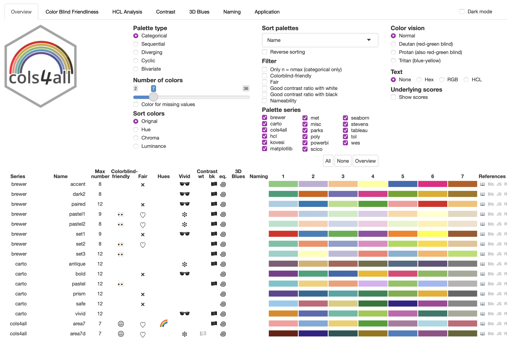

## Introducción

Existen múltiples paquetes dentro del universo de R diseñados para trabajar con colores y paletas en gráficos. Sin embargo, `cols4all` (*Colors for All*) es, sin duda, uno de los más completos e interesantes de los últimos años.

Destaca por varias razones:

- Mantiene paletas bien organizadas y coherentes.

- Permite incorporar series de paletas personalizadas de forma sencilla.

- Incluye un análisis riguroso sobre la accesibilidad del color para personas con deficiencias en la visión cromática (daltonismo).

Actualmente está disponible en [CRAN](https://cran.r-project.org/web/packages/cols4all/index.html) y puedes instalarlo ejecutando:

```{r, eval=FALSE}
install.packages("cols4all", dependencies = TRUE)
```

Entre sus dependencias se encuentran `colorblindcheck` (para evaluar la accesibilidad visual), `ggplot2` (para integrarse de forma nativa con el tidyverse) y `shiny`, que sirve de base para su interfaz interactiva.

Una vez instalado, lo activamos en nuestra sesión:

```{r}
library(cols4all)
```

## Exploración interactiva

La herramienta principal es un panel de control interactivo realizado como una ventana shiny que RStudio muestra en html, que se inicia con:

```{r, eval=FALSE}
c4a_gui()
```


Este panel cuenta con múltiples botones y filtros para explorar paletas categóricas, divergentes, secuenciales, cíclicas y bivariadas. Además, permite simular la compatibilidad con diferentes tipos de daltonismo (como Deuteranopía, Protanopía y Tritanopía).

## Exploración por código

Si prefieres trabajar desde la consola o script:

- `c4a_table()`: Genera una tabla en el visor de RStudio con las paletas y sus métricas de color.

- `c4a_series()`: Muestra las series (familias) de paletas disponibles (actualmente más de 20).

- `c4a_palettes()`: Lista el catálogo completo de paletas incluidas (689 paletas disponibles).

Para visualizar los colores de una paleta específica directamente en la ventana de gráficos, usamos `c4a_plot()`:

```{r}
c4a_plot("powerbi.temperature", nrows = 1)
```

Si queremos extraer los códigos hexadecimales en forma de vector, utilizamos `c4a()`:

```{r}
c4a(palette = "powerbi.temperature")
```

Esto nos devolverá el vector de colores hexadecimales. (*Tip: En RStudio, si pegas estos códigos entre comillas dentro de tu script, verás una vista previa del color de fondo directamente en el editor*).

Para obtener los metadatos completos y evaluar la accesibilidad de una paleta específica, podemos usar `c4a_info()`:

```{r}
c4a_info(palette = "powerbi.temperature")
```
E incluso podemos consultar e imprimir la cita bibliográfica de una serie en formato **BibTeX** con `c4a_citation()`:

```{r}
c4a_citation(name = "powerbi")
```
## Creación de paletas personalizadas

Podemos registrar nuestras propias paletas mediante la función`c4a_data()`, especificando sus argumentos principales:

- `x`: una lista nombrada con las paletas y y sus respectivos vectores de colores.
- `types`: para indicar el tipo de paleta ("cat" para categórica, "seq" para secuencial, "div" para divergente, etc.).
- `series`: el nombre de la nueva serie personalizada a la que pertenecerá.

Por ejemplo, creemos la serie "mis_paletas" con una paleta categórica llamada "mi_atardecer" de 4 colores:

```{r}
datos_paleta <- c4a_data(
     x = list(mi_atardecer = c("#2b5c8f", "#d95f02", "#e6ab02", "#7570b3")),
     type = "cat",
     series = "mis_paletas")
```

A continuación, cargamos la paleta en la sesión activa de R (memoria RAM):

```{r}
c4a_load(datos_paleta)
```

Y ya podemos invocarla utilizando la sintaxis `serie.nombre`:

```{r}
c4a("mis_paletas.mi_atardecer")
```

::: {.callout-note}
## Nota sobre persistencia

Para no perder tus paletas al cerrar R, puedes exportar tu base de datos personalizada con `c4a_sysdata_export()` e importarla en cualquier sesión futura con `c4a_sysdata_import()`.
:::


## Integración con ggplot2

**cols4all** incluye una familia de funciones de escala diseñadas para integrarse sin fricciones como capas de color o relleno en ggplot2.

Su nomenclatura sigue la convención habitual de ggplot2:
`scale_<color/fill>_<discrete/continuous/binned>_c4a_<tipo_paleta>()`

Ejemplo 1: Escala categórica (discreta)

```{r, message=F, warning=F}
library(tidyverse)
library(datos)

pinguinos |> 
  ggplot(aes(x = largo_pico_mm, y = alto_pico_mm, color = especie)) +
  geom_point(size = 2) +
  scale_color_discrete_c4a_cat("carto.safe") +
  theme_light()
```
Aquí usamos `scale_color_discrete_c4a_cat("carto.safe")` para mapear una variable categórica (especie) a una escala discreta y segura para daltonismo.

Ejemplo 2: Escala continua divergente

```{r}
pinguinos |> 
  ggplot(aes(x = largo_pico_mm, y = alto_pico_mm, color = masa_corporal_g)) +
    geom_point(size = 2) +
    scale_color_continuous_c4a_div("wes.zissou1", mid = mean(pinguinos$masa_corporal_g, na.rm = TRUE)) +
    theme_light()
```

En este segundo ejemplo, aplicamos `scale_color_continuous_c4a_div()` para mapear una variable numérica continua a la paleta divergente "wes.zissou1", estableciendo el punto medio (mid) en la media del peso corporal de los pingüinos.

## Bibliografía